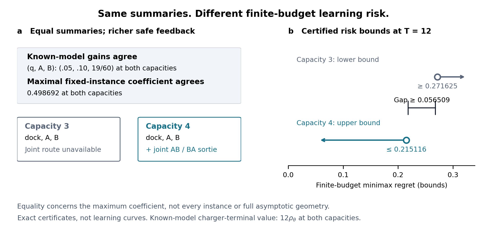

# Resource Augmentation Improves Finite-Budget Learning Without Changing Execution or the Maximal Asymptotic Coefficient

## 1. Introduction

For learning systems that acquire evidence through actions, the acquisition protocol is part of the decision problem, not merely an implementation detail.

An inspection agent must execute a physical trajectory to acquire information. It leaves a charger, visits measurement sites, and returns before allocating its remaining deployment budget. Increasing its resource capacity may allow two measurements within one safe excursion. This need not improve the best inspection behavior once the environment is known. Instead, it can change which combinations of feedback are available when the agent chooses its next route. The distinction raises a learning-system comparison question: can additional resources strictly improve optimal finite-budget learning performance while preserving both known-model execution performance and the maximal fixed-instance logarithmic regret coefficient?

These are two specific summaries, not interchangeable descriptions of learning difficulty. Known-model execution value measures what an informed controller can achieve. A fixed-instance logarithmic regret coefficient prices the exploration required to distinguish decision-relevant alternatives in the long run. Taking the maximum of the attainable coefficients compares the hardest first-order asymptotic exploration price among the fixed hypotheses: the instance-wise coefficients are defined before this maximum is taken. This makes it a capability-versus-learning-price comparison, not a statistical equivalence test or an asymptotic minimax characterization. Structured-bandit theory expresses this price through KL-constrained allocations and establishes asymptotic attainability under regularity conditions. Neither summary alone specifies the feedback-dependent sequence of decisions available before a finite deployment budget expires. Importantly, the general discrepancy between finite-time difficulty and asymptotic logarithmic coefficients is already recognized in side-observation theory. Our question is narrower: whether a resource-realizable enlargement of the experiment space can preserve these two summaries while strictly changing finite-budget minimax regret. [Structured allocation and OSSB](https://proceedings.neurips.cc/paper/2017/file/e19347e1c3ca0c0b97de5fb3b690855a-Paper.pdf), [finite-time side observations](https://proceedings.neurips.cc/paper/2015/file/8e82ab7243b7c66d768f1b8ce1c967eb-Paper.pdf).

Controlled sensing is the parent framework for this investigation. Action-dependent information, adaptive experiment selection, and finite-horizon sensing/exploitation utility are established ingredients. We neither introduce them nor claim that a battery makes the problem irreducible to controlled experiments. We compare nested safe experiment spaces over the same hypothesis class, preserving the durations and feedback laws of all old experiments. Existing sensing and allocation results supply the analytical tools; their stated conclusions do not, by themselves, establish the resource-realizable conjunction studied here. The candidate contribution is this separately certified separation, not a new formulation or a new minimax duality. [Controlled sensing](https://arxiv.org/pdf/1205.0858), [finite-horizon sensing utility](https://arxiv.org/pdf/1705.05960).

We establish a robust separation in a regenerative inspection system. Capacity augmentation permits a shared-measurement excursion but leaves every hypothesis's optimal average execution gain unchanged. Known-model charger-terminal execution values also agree at the specified endpoint budgets. The maximum of attainable fixed-instance logarithmic regret coefficients remains unchanged, yet finite-budget minimax regret strictly decreases. At the reference instance and budget twelve, an exact lower certificate for the smaller capacity exceeds an attainable upper certificate for the larger capacity by at least 0.056509475. The gap persists throughout an open four-dimensional structural parameter neighborhood, so it is neither a sampled fluctuation nor a single numerical coincidence.

The controls distinguish this result from several simpler explanations. Disabling bundling makes the capacity levels equivalent at every finite budget: increasing the counter value alone has no statistical effect. Both measurement parameters are already observable at the smaller capacity. Moreover, a feedback-free charger-terminal control cannot match the adaptive witness. The witness commits to each complete sortie and adapts only between sorties. Thus the mechanism concerns joint feedback available for allocating future calendar budget; it does not establish that earlier within-sortie feedback or removal of the current route commitment causes the benefit.

The separation is possible because the two summaries and the finite-budget risk are governed by different bottlenecks. An old maximizing hypothesis retains an optimal feasible KL allocation price after the experiment space expands. That preserves the maximal coefficient, even though another hypothesis's coefficient improves. Finite-budget risk instead depends on feedback-dependent continuation at least-favorable priors. A resource-enabled joint experiment can change those continuation opportunities without displacing the hypothesis that determines the asymptotic maximum. Standard duality explains this distinction; the substantive result is its robust resource realization.

The implication for evaluation is deliberately limited but consequential: agreement in known-model execution performance and maximal fixed-instance logarithmic regret coefficient does not certify agreement in optimal finite-budget learning risk. Physically feasible feedback protocols are an additional comparison axis. This is not a guarantee that an arbitrary deployed learner exploits the opportunity. Our frozen horizon-free calibration at budget 4096 did not display the capacity benefit, and we retain that negative result as a diagnostic. The paper therefore separates an optimal-risk theorem from algorithm-specific operational performance rather than treating asymptotic attainability as finite-budget validation.

**Figure 1. Two equal summaries do not certify finite-budget equivalence.** At the reference model, both capacities have the same hypothesis-wise average gains and maximal fixed-instance logarithmic regret coefficient. Their known-model charger-terminal values agree at budget twelve. Only capacity four permits a joint safe measurement sortie. The right panel shows an exact lower bound for capacity three and an attainable upper bound for capacity four—not exact minimax values, empirical learning curves, or confidence intervals. The arrows indicate the directions of the bounds. Equality of the maximal coefficient does not mean equality of every hypothesis's coefficient. [Editable SVG](figures/resource_separation_v2/figure1_resource_separation.svg), [vector PDF](figures/resource_separation_v2/figure1_resource_separation.pdf). The original figure is preserved as an earlier version.

## 2. Comparison setting

### 2.1 A fixed public family and a known resource counter

Consider known deterministic regenerative routes with a unique charger \(q\). Every primitive action consumes one unit of calendar time and resource. Consumption is debited before replenishment; arrival at the charger restores capacity \(B\). The initial preparation/undocking action does not itself reload the resource. Reward observations are independent Bernoulli draws conditional on the unknown hypothesis. Travel steps yield zero reward, and each measurement site may be sampled at most once per sortie.

The route catalogue contains docking, an empty return excursion, single-site excursions, and joint excursions. Docking lasts one step and yields a Bernoulli reward of mean \(r\). The empty excursion lasts two steps. Single-site routes \(A\) and \(B\) last three steps, with measurement at step two. Joint routes \(AB\) and \(BA\) last four steps, with measurements at steps two and three. Capacity three excludes the joint routes; capacity four enables them when bundling is on. With bundling off, the agent must return after the first measurement. No primitive reward law, old route duration, or old feedback law changes across capacities.

Fix the public structural parameter \(z=(r,u,v,w)\). The learner knows \(z\) but not its hypothesis label in

\[
\Theta_z=\{\theta_q=(u,r),\quad\theta_A=(v,r),\quad\theta_B=(v,w)\},
\]

where each pair gives the means at sites \(A,B\). The docking mean is \(r\) under all three hypotheses. This shared-mean structure is part of the model, not a parameter estimated separately for each capacity. All primitive laws are fixed when capacity changes.

### 2.2 Risk and the two summaries

Let \(\rho_{B,\theta}(z)\) be the optimal known-model average reward over safe policies. For a learner \(\mathcal A\) that does not know the hypothesis label, define

\[
R_{B,\theta}^{\mathcal A}(T;z)
=T\rho_{B,\theta}(z)-\mathbb E_{\theta}^{\mathcal A}\sum_{t=0}^{T-1}Y_t,
\qquad
v_{B,z}(T)=\inf_{\mathcal A}\max_{\theta\in\Theta_z}R_{B,\theta}^{\mathcal A}(T;z).
\]

The infimum permits safe primitive-feedback policies, including arbitrary legal terminal positions. Charger-terminal execution values and controls are identified separately below. Let \(C_{B,\theta}(z)\) denote the attainable fixed-instance logarithmic regret coefficient from the existing path-catalogue characterization, and write

\[
C^{\max}_{B,z}=\max_{\theta\in\Theta_z}C_{B,\theta}(z).
\]

This is a maximum of fixed-instance coefficients. It is not a claim about interchanging a worst-case supremum with an asymptotic limit or about an asymptotic minimax constant.

## 3. Main result: robust asymptotic-neutral finite-budget separation

### Theorem 1

Let \(z_0=(1/20,1/20,3/10,19/20)\) and

\[
\mathcal U=\{z:\|z-z_0\|_\infty<10^{-4}\}.
\]

For every \(z\in\mathcal U\), the capacity-three and capacity-four bundling-on systems defined above satisfy:

1. **Hypothesis-wise execution equality.** Their optimal average gains agree:

   \[
   \rho_{3,\theta_q}=\rho_{4,\theta_q}=r,\quad
   \rho_{3,\theta_A}=\rho_{4,\theta_A}=v/3,\quad
   \rho_{3,\theta_B}=\rho_{4,\theta_B}=w/3.
   \]

   The unique optimal complete-route types are respectively docking, \(A\), and \(B\) at both capacities. At \(T=12,24\), the known-model charger-terminal optimum equals \(T\rho_{B,\theta}\) for every hypothesis and both capacities.

2. **Equality of the maximal fixed-instance coefficient.** With \(\operatorname{kl}\) the Bernoulli KL divergence,

   \[
   C^{\max}_{3,z}=C^{\max}_{4,z}
   =\frac{3r-u}{\operatorname{kl}(u,v)}.
   \]

3. **Strict finite-budget statistical improvement.** Despite those equalities,

   \[
   v_{3,z}(12)-v_{4,z}(12)>0.038509475.
   \]

4. **Capacity-only negative control.** Disabling bundling yields, for every finite integer budget \(T\),

   \[
   v_{4,z,\mathrm{off}}(T)
   =v_{3,z,\mathrm{off}}(T)
   =v_{3,z,\mathrm{on}}(T).
   \]

The neighborhood is open within the specified four-dimensional structural family. The theorem does not assert robustness to arbitrary independent perturbations of the entire reward matrix.

### What is—and is not—preserved

The individual coefficients are

\[
C_{3,\theta_q}=C_{4,\theta_q}=\frac{3r-u}{\operatorname{kl}(u,v)},\qquad
C_{3,\theta_A}=\frac{v-r}{\operatorname{kl}(r,w)},\qquad
C_{4,\theta_A}=\frac{v/3-r}{\operatorname{kl}(r,w)},\qquad
C_{3,\theta_B}=C_{4,\theta_B}=0.
\]

The \(q\) hypothesis continues to determine the maximum throughout \(\mathcal U\), while the \(A\) coefficient decreases. Accordingly, Theorem 1 preserves neither all instance coefficients nor the full asymptotic information geometry. The optimal route is preserved across capacities at each hypothesis; one route is not optimal across all hypotheses.

### Certificate and evidence roadmap

The main theorem assembles the existing exact certificate, coefficient calculation, and robustness argument; this section does not introduce a new numerical search. At the anchor,

\[
v_{3,z_0}(12)\ge\frac{2173}{8000}=0.271625,
\qquad
v_{4,z_0}(12)\le\frac{8604621}{40000000}=0.215115525.
\]

The lower certificate covers primitive-feedback policies with arbitrary legal terminal positions. The upper certificate is attained by a safe, charger-terminal randomized witness that adapts between committed sorties. Subtraction gives a gap of at least \(0.056509475\). The existing uniform policy-value perturbation bound is \(L_T\varepsilon\), with \(L_T=T(T+3)/2\). Applying it on both sides at \(T=12\) reduces the certified gap by less than \(180\cdot10^{-4}\), giving the stated open-neighborhood conclusion. Execution equality, coefficient dominance, and the off-control are established separately in the source derivations.

As an additional, explicitly scoped control, the exact feedback-free **charger-terminal** capacity-four risk at the anchor and budget twelve is \(32/115\), exceeding the adaptive upper certificate. This rules out that control as an explanation of the witness advantage; it does not prove within-sortie adaptivity is necessary.

Sources: [strict finite-budget certificate and controls](STRICT_FINITE_BUDGET_CAPACITY_BENEFIT_20260916.md), [open-region robustness](ROBUST_RESOURCE_BUNDLING_SEPARATION_20260916.md), [path-catalogue attainability](RESOURCE_PATH_CATALOGUE_ATTAINABILITY_20260916.md).

### Reusable comparison certificate

The separation has a two-part diagnostic. First, an old maximizing hypothesis's optimal KL allocation dual must remain feasible for every new experiment. Second, new safe feedback policies must lower prior-weighted regret below the old minimax value at **every** old least-favorable prior. Under the finite-game and attained-allocation assumptions, these conditions are necessary and sufficient for maximal-coefficient equality together with strict finite-budget improvement. The second condition can be certified without identifying least-favorable priors: an old Bayes lower certificate \(l\) and one implementable new policy with worst risk \(U<l\) give \(v_1-v_2\ge l-U\). This makes the comparison reusable while preserving the status of minimax and allocation duality as established tools. [Diagnostic proposition and complete proof](RESOURCE_SEPARATION_DIAGNOSTIC_AND_TRANSFER_20260916.md).

### Two bottlenecks: explanation, not new foundational theorems

For nested controlled experiment systems, let \(V_j(T,\pi)\) be optimal Bayes reward under prior \(\pi\), and set \(b_j(T,\pi)=T\pi\cdot\rho-V_j(T,\pi)\). Finite-game minimax duality gives \(v_j=\max_\pi b_j\). Writing \(g=V_2-V_1\ge0\),

\[
v_1-v_2=\min_\pi\big[(v_1-b_1(T,\pi))+g(T,\pi)\big].
\]

Under the finite-game continuity conditions, strictness requires improvement at every old least-favorable prior, not merely at one chosen prior. In contrast, maximal logarithmic-coefficient preservation can be certified by an old maximizing hypothesis's optimal allocation dual remaining feasible after adding experiments. The new experiment constraint may be tight; neutrality does not require it to be inactive. These standard criteria explain how different bottlenecks coexist. They are not promoted to additional foundational contributions. [Interpretive derivation](RESOURCE_ENABLED_FINITE_BUDGET_PRINCIPLE_20260916.md).

## 4. Related-work positioning

The comparison below is between stated result scopes, not a claim that the parent frameworks cannot represent our model or that no unexamined paper contains the conjunction.

| Area and primary source | Established capability credited here | Distinction of the present claim |
| --- | --- | --- |
| [Controlled sensing](https://arxiv.org/pdf/1205.0858) | Action-dependent observations, causal versus open-loop controls, asymptotic multihypothesis testing guarantees | Our conclusion concerns cumulative-regret minimax risk under execution-preserving resource nesting, not a new adaptive-testing formulation. |
| [Finite-horizon sensing utility](https://arxiv.org/pdf/1705.05960) | Remaining-budget-dependent sensing, stopping, and exploitation decisions | Finite continuation value is prior art; the separately certified conjunction additionally preserves the maximal fixed-instance logarithmic regret coefficient. |
| [Structured bandits / OSSB](https://proceedings.neurips.cc/paper/2017/file/e19347e1c3ca0c0b97de5fb3b690855a-Paper.pdf) | Confusing-alternative KL allocations and asymptotically efficient structured exploration | Our finite-budget gap is not inferred from a coefficient gap: the maximal coefficient agrees, and the resource enlargement must be physically realizable while preserving old experiments and execution comparators. |
| [Side observations](https://proceedings.neurips.cc/paper/2015/file/8e82ab7243b7c66d768f1b8ce1c967eb-Paper.pdf) | Extra feedback changes finite-time learning; logarithmic asymptotic descriptions can hide finite-time difficulty | The broad finite/asymptotic distinction is not new. We isolate a robust resource-realizable separation with unchanged execution values and unchanged maximal fixed-instance coefficient. |

Thus the defendable claim is a separation regime within controlled experiments. It is not formulation, KL-allocation, posterior-value, or algorithmic novelty. The narrower claim remains subject to independent prior-art assessment. [Detailed positioning and primary locators](CONTROLLED_SENSING_REDUCTION_POSITIONING_20260916.md), [evidence ledger](CONTROLLED_SENSING_POSITIONING_EVIDENCE_20260916.md).

## 5. Discussion

### Implications for learning-system evaluation

Theorem 1 identifies a missing comparison axis, not a general failure of asymptotic analysis. Execution capability asks what is achievable once the model is known, under specified terminal requirements. The maximal fixed-instance logarithmic regret coefficient prices the worst instance in the asymptotic allocation problem. Feasible feedback acquisition specifies which joint experiments can exist, their calendar and resource costs, when observations arrive, and which subsequent actions may condition on them. Agreement in the first two summaries does not determine finite-budget learning risk. In our construction, both measurement parameters remain queryable at both capacities; the shared trajectory changes their joint acquisition and subsequent use.

This suggests a concrete reporting rule for resource comparisons: make the acquisition protocol visible alongside execution and asymptotic summaries. Report the safe experiment catalogue, preparation/travel and recovery/reset costs, observations per experiment, feedback timing, and allowed conditional continuations. Hold the public hypothesis class, reward laws, initial information, clock convention, and execution comparator fixed, and state the terminal restrictions of each risk certificate or measured policy. Disabling bundling while retaining capacity isolates the newly feasible joint experiment from the counter increase alone. These are scoped evaluation recommendations, not a universal scalar metric for feedback geometry or a claim that existing benchmarks universally use only the two summaries.

Finally, available optimal-risk improvement and realized learner benefit are different evaluation claims. The frozen horizon-free calibration did not show improvement at T=4096, while the horizon-specific safe witness establishes the certified minimax bound at T=12. Neither result substitutes for the other. Controlled sensing provides the parent language; this paper certifies a specific comparison failure under resource-realizable nesting. The assay-batch transfer provides non-navigation realizability, not a second empirical validation. [Full AI relevance layer and protocol card](ICML_AI_RELEVANCE_LAYER_20260916.md), [claim audit](ICML_AI_RELEVANCE_LAYER_AUDIT_20260916.md).

### Why physical feasibility matters without defining a new framework

Resources determine whether a joint feedback trajectory exists, not just a scalar price attached to an observation already available. At the smaller capacity, both measurement means remain accessible, but collecting them requires separate safe excursions. At the larger capacity, the agent can share acquisition overhead and use joint feedback before allocating another excursion. The off-control preserves the larger capacity while removing this route, eliminating the risk separation. Resource realizability consequently restricts how an abstract experiment-set enlargement may be implemented. It does not place the problem outside controlled sensing or structured experimentation.

### Why the maximum can stay fixed

Preserving a scalar maximum is weaker than preserving all asymptotic learning costs. Here the improvement in the \(A\) instance does not remove the \(q\) instance's allocation bottleneck. The maximum remains unchanged precisely because that bottleneck survives. This limits the claim but also makes the comparison concrete: a worst fixed-instance logarithmic summary can miss a finite-budget improvement even when some individual coefficients reveal part of the changed acquisition geometry. The result should not be described as statistical equivalence, full information-geometry neutrality, or equality of asymptotic minimax constants.

### Adaptivity and commitment

The improving witness completes each selected route before choosing another. Bundled feedback changes the information jointly available for its next calendar-budget commitment. Its advantage over the feedback-free charger-terminal control supports the role of adaptive information use, but does not isolate observation timing from travel sharing, establish a universal adaptivity benefit, or prove that within-excursion adaptation is required. The finite-game continuation analysis is an interpretation of the certified separation, not a claim to have introduced posterior-dependent decision value.

### What the negative calibration establishes

The frozen horizon-free calibration at \(T=4096\) returned primary pseudo-regret 4.30 for high/on and 4.10 for low/on; both off conditions returned 4.10. Those results preserve the negative control but do not validate deployed-learner capacity benefit. The subsequent diagnostic found the theoretical LP and calendar-time cost correctly connected: finite-time all-path coverage and certificate-first scheduling added joint-route exploration rather than replacing the expensive single-site queries at that budget. This explains the observed learner trajectory without proving a fundamental capacity penalty or asymptotic attainability failure. One paired calibration seed also does not establish a population-level algorithm gap. The exact finite-budget theorem and this negative operational result answer different questions and are both retained.

### Scope and remaining obligations

The same primitive-history system also has an idealized non-navigation realization: automated assay batches with resource-consuming preparation and mandatory cleanup around a replaceable cartridge. A history bijection preserves all safe feedback policies, time/resource debits, observation laws, and terminal qualifications, so the risk separation transfers exactly. This is a proof of non-navigation realizability, not a second dataset or an independent problem class. [Operational model and transfer proof](RESOURCE_SEPARATION_DIAGNOSTIC_AND_TRANSFER_20260916.md).

The strict result concerns a small finite hypothesis system, a short certified budget, and an open neighborhood within a fixed structural family. It does not establish strict benefit for every larger capacity, every budget, or arbitrary reward topologies. General monotonicity follows from ignoring new safe experiments when comparators and old laws remain unchanged; strictness needs the additional decision-value certificate. Nor do the present results establish a general statistical–computational complexity separation, realistic robotics deployment, or superiority of a practical learner. Independent proof and prior-art audits remain submission obligations, not results manufactured by paper assembly. Within those boundaries, the reader takeaway is sharp: resource configuration can change optimal finite-budget learning risk even when these two specific execution and asymptotic summaries agree.
