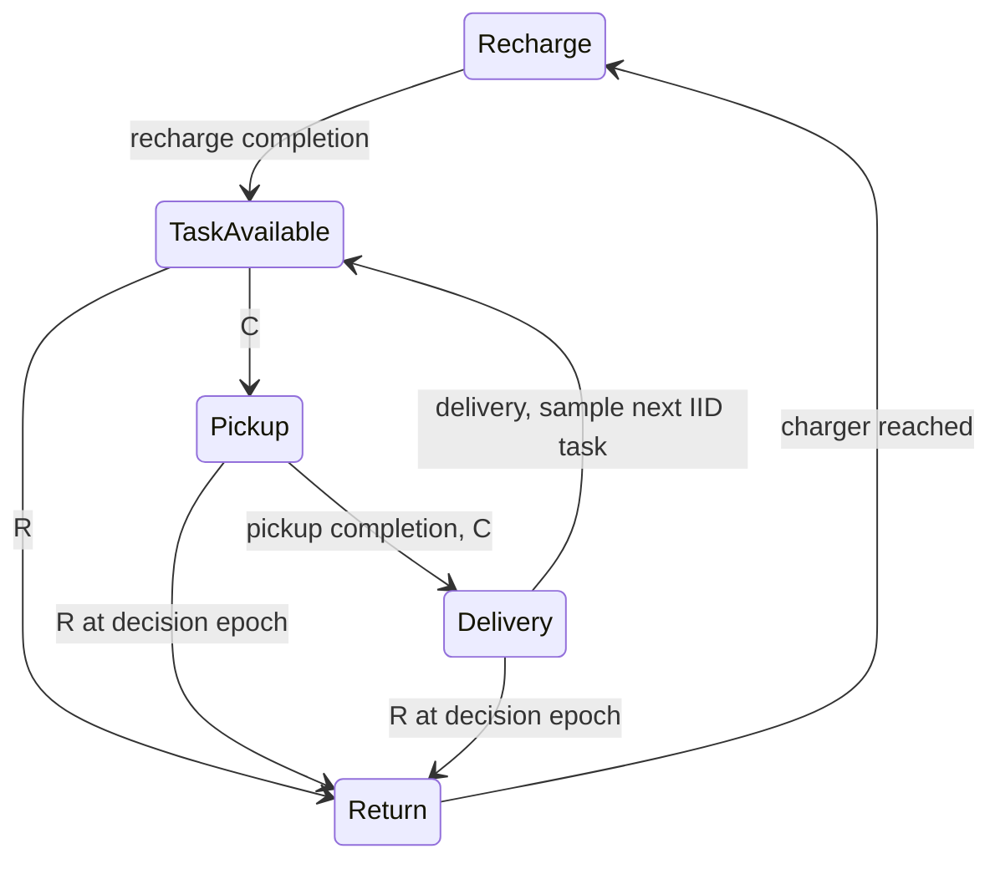

# Safe Regenerative Average-Reward Control for Persistent Agents

## Current amendment — user-authorized P1, 2026-09-19

**P0-A navigation qualification: PASS for research startup in the restricted
study region. P0-B legacy energy-predictor qualification: cancelled / no longer
required, not FAIL.** The user explicitly authorized continuing to P1 with
measured frozen-SAC macro transitions; do not recover or retrain a critic.
The earlier audit below preserves the evidence and its then-current stopping
rule, which is superseded by this amendment. The 18-route data and frozen runner
are unchanged. Old ReturnManager is no longer a mandatory baseline. This turn
is P1 only; P2 requires subsequent user authorization.

See [P1 implementation and audit](REGENERATIVE_CONTROL_P1_20260919.md).

## Historical Material Passport

- Date: 2026-09-19; mode: bounded code execution + artifact audit.
- User question: 在具有可再生资源的持续任务流中，何时继续当前任务、何时主动返回补给，以最大化长期平均任务收益，同时维持可恢复性？
- Scope: P0 → P1 → minimal P2, sequential gates. No SAC/high-level training.
- Current status: **P0 not passed: energy qualification incomplete. P1/P2 stopped before implementation.**
- Evidence: `artifacts/regenerative_p0_20260919/summary.json`, `energy_inventory.json`, `qualification/freeze.json`, `qualification/route_000.json` through `route_017.json`.
- This is not a paper, scientific mechanism finding, or performance comparison. Working title remains provisional. The user's Level 2/5 assessment is unchanged.

## P0: frozen navigator

Checkpoint:
`artifacts/hocbf_correction_sac_20260908_v1/sac/checkpoint_000131072/model.zip`

```
checkpoint_sha256 = fb79482ae7d832b40137ff1a080ee84912eabb95867e118aca80c846f6ae62be
training_seed = 0
training_steps = 131072
environment_commit = ad561b091a89eef72910b52f4593e01b43592606
```

The actor is extracted directly from `policy.pth`, with strict parameter-key/shape
matching. No optimizer, critic, or replay state is restored; all actor parameters
have gradients disabled and inference uses deterministic actions. Architecture:
existing DirectionalLidarExtractor (2081 features), actor MLP [256, 256]. No weight,
reward, sensor, or low-level action changes. The actor's learned remaining-option-
time input is retained; this is a future macro-option time variable, not permission
to impose a finite scientific task horizon.

Observation (2056): normalized velocity (3), relative goal direction (3), normalized
log distance (1), LiDAR distances (1024), LiDAR hit flags (1024), remaining option
time (1). Goal switching uses the same actor. Actions are normalized acceleration
(3), with inherited horizontal norm clipping and physical limits 5/5/3. Existing
LiDAR HOCBF remains enabled. Collision repair, velocity reset and -1.2/-0.42 contact
semantics remain inherited unchanged. New results contain only unified collision
counts. Source hashes are stored in the freeze manifest and checked after execution.

This selects the retained original navigation checkpoint, not the unrelated recent
public quadrotor control-adaptation startup. Neither experiment is trained here.

## P0: actual navigation measurements

Predeclared 18 cells: 3 target roles × distances 100/300/600 × 4/24 obstacles;
seeds 219190001–219190018, no replacements. Start from rest, constant altitude 200,
charger at [2880, 2000, 200]. Pickup goes west from charger; dropoff goes north from
pickup; return goes east to charger. These are target-role navigation legs only;
no pickup service, payload dynamics, continuing stream or mission composition is
claimed. Reset between independent P0 qualification trials is intentional.

| Goal role | Reached | Routes with contact | Mean travel time (simulator seconds) | Mean consumed energy |
|---|---:|---:|---:|---:|
| Pickup | 6/6 | 0/6 | 20.275 | 3.98690 |
| Dropoff | 6/6 | 0/6 | 21.525 | 4.40879 |
| Charger return | 6/6 | 0/6 | 22.075 | 4.16188 |

Overall: 18/18 reached; 0 contact routes; 0/1924 policy steps with contact.
Energy is the existing synthetic telemetry-cost unit, not Wh. Recorded time is
actual simulator time, not a constant timestep multiplied by step count.

Each cell has only one scene. The 24-obstacle setting is a denser global layout,
not evidence that every particular route has a difficult obstacle encounter.
These observations support basic execution in this restricted geometry, not a
95% reliability guarantee, full-map navigation stability, or generalization.
No navigation-dominant failure was observed in these 18 trials.

## P0 blocking evidence: energy interface/coverage

The retained energy checkpoint has heads:
`seed{0,1,2}/{mean,quantile95,defective}`. Its contract declares q=.95;
it is not the four-output goal-conditioned Q50/Q90/Q95/Q99 checkpoint described
in the requested P0. Its original data path labels return-leg suffix energy and
collision-free arrival (`return_energy_data.py`), not pickup+dropoff+return energy.
The repaired defective-CDF model changes a global log-energy scale; that does not
establish mission quantile calibration.

The navigation environment defaults to `energy_estimator=None`. The retained SAC
archive contains policy/optimizer tensors, not a bound external mission energy
estimator. `GoalConditionedQuantileTDEnergyEstimator` and `ReturnManager` classes
exist in source, but class availability is not a trained predictor or calibration
receipt. The repository minimization record confirms historical artifact removal;
the AGENTS.md cleanup link `docs/REPOSITORY_CLEANUP_20260908.md` is now absent.
The surviving account is `docs/REPOSITORY_MINIMIZATION_20260914.md`.

| Required calibration | Status |
|---|---|
| Return Q50/Q90/Q95/Q99 empirical coverage | Not validated in the selected region |
| Task+return Q50/Q90/Q95/Q99 empirical coverage | No matching trained predictor/provenance identified |
| ReturnManager with frozen compatible predictor | Not qualified for this protocol |

**This is missing evidence, not measured 70% q95 coverage, and not a finding that
SAC navigation failed.** We do not silently initialize a critic, train a new head,
add marginal q95 values and call their sum a joint q95, use exact simulator geometry
in a deployable predictor, or infer coverage from successful navigation.

P0 therefore cannot authorize P1. The next necessary input is the intended frozen
energy estimator/checkpoint with its feature/output contract, or an explicit
revision to qualify an empirical energy model. The user subsequently confirmed that they probably have no such checkpoint and
it may have been deleted. No replacement model was selected based on these
outcomes. A possible next bounded route is a separately calibrated empirical
energy model from frozen SAC rollouts (no neural training); it would be a new
reference, not recovery or qualification of the deleted critic. This route has
not been executed.

## P1/P2 deliverables: not executed

A. Environment: only single-UAV P0 navigation exists for this new protocol. The
continuing IID task stream, paid recharge, high-level C/R epochs, evaluation cutoff,
and regenerative cycle logging are **not implemented or validated** here.

The following is a prospective state diagram, not an observed trajectory:



Recharge completion is a candidate regeneration epoch. It becomes a renewal epoch
only after specifying the distribution of post-recharge task/process state, motion,
and other carried state. An arbitrary recharge with a retained task or correlated
future process is not automatically IID regeneration. Keep paid travel, recharge,
waiting and abandonment; retain contacts without resetting the physical task.

B. Frozen SAC: measured table above; energy coverage remains unavailable.

C. Oracle: not built; no state-space size, transition error, or exactness claim.
Planned finite empirical SMDP must model duration in its average-reward Bellman
operator. Exact solution of an estimated/discretized model is not an exact oracle
for the original continuous simulator. Full simulator state may serve that oracle;
deployable energy features remain restricted to LiDAR and known charger/battery.

D. Requested comparison (all **not run**, not zero):

| Method | Throughput | Energy failure | Return failure |
|---|---:|---:|---:|
| Oracle | N/A | N/A | N/A |
| Battery threshold | N/A | N/A | N/A |
| Expected reserve | N/A | N/A | N/A |
| q95 mission reserve | N/A | N/A | N/A |
| ReturnManager | N/A | N/A | N/A |
| MPC H=1/2/3 | N/A | N/A | N/A |

E. Mission margin versus ΔQ figure: unavailable; no valid mission q95 or Q* labels.
F. Comparable-state pairs: 0 generated; opposite-sign fraction **undefined**, not 0%.
G. Explanation: **没有 sign-flip 数据，当前不能归因。**

No long continuing trajectory or fabricated mechanism plot is supplied to fill
these evidence gaps. No PAI/PSPS runs, multi-UAV work, literature expansion, new
neural models, reward tuning, or downstream training were launched.

## Verification and reproduction

One one-step smoke passed. The unchanged smoke resumed without re-executing its
saved route. The bounded 18-route qualification completed without an error; each
route is atomically saved and an identical manifest is required for `--resume`.
This is route-boundary resumability, not a new mid-route simulator checkpoint.
Both Python files compile. The audit verifies all 18 job identities, source hashes,
checkpoint hashes and retained head-to-navigation provenance. No broad test/gate
chain was added. No background evaluation or training remains from this task.

```bash
PYTHONPATH=. .venv/bin/python research/regenerative_control/audit_p0.py
PYTHONPATH=. .venv/bin/python research/regenerative_control/qualify.py --output artifacts/regenerative_p0_20260919/qualification --resume
```

The second command checks the same frozen contract and skips all 18 completed
routes; it does not start P1/P2. Do not edit the frozen runner in place and then
reuse its output directory.

## Preserved next-stage stopping rules

P0 must pass before P1; P1 must demonstrate no hidden reset and paid recharge
before P2. Minimal P2 includes battery, return reserve, mission reserve,
expected-energy reserve, MPC H=1/2/3 and frozen ReturnManager with shared navigation.
Do not train high-level neural policies before P0–P3 pass.
If the strongest simple policy reaches ≥.98 oracle throughput with comparable
safety, pause the complex-state line; do not change the cutoff to rescue it.
The safety-comparability tolerance must be frozen before the actual comparison.
P4 additionally requires a stable material gap, no navigation confound, systematic
interpretable sign flips and a general explanatory state variable. Formal results
use independent stream/run or valid regenerative-cycle uncertainty, never timestep
IID resampling. No P4 authorization is inferred from completing infrastructure.
