# P1.1 — separate regenerative control from task screening

## Scope and status

User review: P1 PASS; perform this semantic correction before P2. Based on
`238b61e959940cd21de787fe95f7243dad005eb2`. This change implements only post-delivery
C/R, forced home departure, semantic tests and the three requested bounded sanity
trajectories. No oracle, reachable-state census, branching dataset, state-abstraction
study, q95 fit, critic, high-level learning or P2 experiment is included.

P0-A remains PASS for restricted research startup; legacy critic qualification
remains cancelled. Current level remains 2/5; this correction is not a scientific
finding or evidence that simple reserve is insufficient.

## Corrected H/D semantics

```mermaid
stateDiagram-v2
    [*] --> H: one initial charged-state reset
    H --> Task: forced IID draw, no policy choice
    Task --> D: delivery; clear task; retain physical state
    D --> Task: C committed, then fresh IID draw
    D --> Return: R; no draw or discard
    Return --> Docking: charger reached
    Docking --> Charging: paid capture
    Charging --> H: paid recharge completion, task=None
    Task --> Failed: depletion / navigation timeout
    Return --> Failed: depletion / navigation timeout
```



- **D-state**: `phase == "decision"`, `task is None`; actions C/R only.
- **C**: first record the committed C decision, then draw exactly one IID task
  uniformly from distances 100/300/600, execute pickup→dropoff without another
  high-level choice, clear the completed task and enter D. No next task is drawn
  at delivery.
- **R**: return and pay for the unchanged docking/charging service. There is no
  known task to reject. R does not advance the task RNG or task draw counter.
  `abandoned` is removed from the new object's main state/audit.
- **H-state**: `phase == "home"`, full battery, canonical home position and zero
  velocity, no task. Both `execute("C")` and `execute("R")` are rejected here.
  Only `advance_home(actor)` is legal: draw and execute the mandatory first task.
  This forced transition has its own duration, energy and delivery reward record;
  it is not free time omitted from throughput accounting.
- A failed/censored unfinished task can remain recorded for audit, but cannot
  become a fresh D-state or be replaced through a C/R call.

At `recharge_complete`, the inherited event label is `phase="regenerated"` and
`task=None`; the returned operational state is H. There is no task draw between
that event and the subsequent `forced_first_task` event. At a cutoff, forced
execution is not started outside the measurement window.

Initial construction also leaves H task-free, with zero task-RNG draws. The
plant's fixed initialization goal is a physics placeholder, not a sampled pending
job; navigation to a task begins only after the forced draw.

## What is unchanged

`PostDeliveryUAV` in `research/regenerative_control/continuing_p11.py` inherits
P1 navigation and paid station mechanics, and replaces only task lifecycle and
macro dispatch. The historical `ContinuingUAV.execute()` is never called by the
new runner. Its legacy draw-after-initialization/recharge hook is explicitly
suppressed; all new task draws occur in the new task-execution path.

The P1 implementation, original nine tests, 128-row evidence and original trace
are preserved. No low-level simulator, SAC, collision, HOCBF, charging price,
capacity, layout or task-geometry change was made. Frozen SAC SHA256 remains:

```
fb79482ae7d832b40137ff1a080ee84912eabb95867e118aca80c846f6ae62be
```

Capacity 60, fixed 24-obstacle layout seed 319190002, charger [2880,2000,200],
docking speed 1 / power .02, charging overhead 10 seconds and rate 1 energy/second
are unchanged. Units remain synthetic telemetry-energy units and simulator seconds.
Contacts remain nonterminal, with the frozen -1.2/-0.42 rule and unified count.
Position, velocity, battery, clock and contact memory persist at task boundaries.

Regeneration remains conditional on a fixed map, stationary task process and a
controller whose relevant memory also renews. RNG state and cumulative logs are
replay/bookkeeping, not claimed to be literally reset each cycle. The task RNG
advances continuously, never reseeds at recharge. Full RNG/map state is exported
only for privileged replay/audit; none enters the frozen actor or sanity decision
rules. Future P2 must not use saved RNG state to peek at the next IID task.

## Tests and bounded execution protocol

**15 focused tests pass: original 9 plus 6 new tests.** New tests cover:

1. Initial H has no pending task, no draw and no C/R choice.
2. Mandatory H task ends in task-free D without an extra draw at delivery.
3. Committed C draws exactly once; invalid actions draw nothing.
4. R leaves task RNG/draw count unchanged; recharge is canonical and task-free;
   only the subsequent forced H transition draws a task.
5. Pending-task injection cannot enable rejection or replacement.
6. Atomic H snapshot/resume preserves the next draw and real cutoff behavior.

Lifecycle-order tests isolate navigation with a deterministic stub; actual SAC
trajectories below separately verify end-to-end physical execution. One .2-second
new-path SAC smoke passed. The first full forced task checkpoint was saved at
40.3 seconds, one delivery, one draw and one initial reset; it was resumed to
finish only the three requested sanity trajectories. No large follow-up was run.

`run_p11.py` freezes the following rules before outcomes, with shared task-stream
seed 719190001 and cutoff 1,000 seconds each:

| Rule | At D |
|---|---|
| recharge after 1 | R after one completed task since H; otherwise C |
| after 2 | R after two completed tasks since H; otherwise C |
| threshold 30 | C iff energy > 30; otherwise R |

Every rule must use forced H departure; none reads a pending task, map geometry or
RNG. There is no hidden safety fallback added to the after-2/threshold rule. A
physical failure ends that trajectory, is retained in the table, and is not retried
with another seed. These are single-seed semantic sanity traces, not a benchmark,
optimality comparison or claim that nontrivial reserve insufficiency exists.

## Audit and reproducibility

The raw audit checks every macro boundary for exact state continuity, every D
start for `task=None`, every R for unchanged task RNG/draw count, every delivery
for task-free D, every H start for forced action, and every recharge event for
canonical physical state. It also checks that all three policies consume the
same IID task sequence prefix: R cannot skip an unfavorable known task or advance
the stream to a preferred sample.

The inherited depletion convention clips battery after a full physics substep.
Any raw-demand balance residual on depletion remains disclosed, not silently
fixed by changing flight physics. Successful traces must close the energy ledger
to <1e-8. No state bins, conditional-risk estimates, baseline margins or P2 values
are constructed here.

Each policy has an atomic, source-contract-bound checkpoint after every macro
transition. Future draws and H/D state survive resume. Completed trajectories
are skipped on resume; a changed source contract is rejected. Local checkpoints
use trusted local pickle; portable review evidence uses JSON/gzip.

## Actual sanity results

| Policy | Deliveries | Recharge completions | Depletion | Collision steps | Plant resets |
|---|---:|---:|---:|---:|---:|
| after_1 | 11 | 11 | 0 | 0 | 1 |
| after_2 | 13 | 6 | 0 | 0 | 1 |
| threshold_30 | 13 | 4 | 0 | 0 | 1 |

All three use the same 1,000-second measurement window and task-stream seed.
Navigation ends on the inherited 0.05-second physics grid: actual recorded end
times are 999.977818, 999.978781 and 999.985827 seconds respectively, each <0.05s
short of the cutoff. The remaining fractional interval is censored, not a reset
or free task. All end with an unfinished task; draws are 12/14/14 versus completed
jobs 11/13/13. That difference is censoring, not rejected tasks.

The raw audit confirms identical consumed-task prefixes across policies and zero
R-induced draws. Energy-ledger residuals are -1.734e-12, -1.351e-12 and -2.750e-13.
This shows the requested task-screening confound is removed and the recharge
rules induce different service/throughput traces. It does **not** establish a
nontrivial optimal C/R boundary, conditional risk, simple-reserve insufficiency,
or a policy ranking that generalizes beyond this one stream.

## One continuing trajectory: after-2

Selected actual events from the 1,000-second after-2 trace:

```text
    0.000  initial_charged_state  phase=home           task=None draws=0 energy=60.000
    0.000  forced_first_task      phase=home           task=None draws=0 energy=60.000
    0.000  task_draw              phase=task_execution task=1    draws=1 energy=60.000
   18.050  pickup_reached         phase=pickup         task=1    draws=1 energy=56.340
   40.300  dropoff_reached        phase=dropoff        task=1    draws=1 energy=51.126
   40.300  delivery_complete      phase=decision       task=None draws=1 energy=51.126
   40.300  decision_C             phase=decision       task=None draws=1 energy=51.126
   40.300  task_draw              phase=task_execution task=0    draws=2 energy=51.126
   61.500  pickup_reached         phase=pickup         task=0    draws=2 energy=46.196
   75.100  dropoff_reached        phase=dropoff        task=0    draws=2 energy=43.086
   75.100  delivery_complete      phase=decision       task=None draws=2 energy=43.086
   75.100  decision_R             phase=decision       task=None draws=2 energy=43.086
   86.800  return_reached         phase=return         task=None draws=2 energy=40.175
   86.800  docking_start          phase=docking        task=None draws=2 energy=40.175
   91.718  recharge_start         phase=recharging     task=None draws=2 energy=40.077
  121.694  recharge_complete      phase=regenerated    task=None draws=2 energy=60.000
  121.694  forced_first_task      phase=home           task=None draws=2 energy=60.000
  121.694  task_draw              phase=task_execution task=2    draws=3 energy=60.000
  192.144  pickup_reached         phase=pickup         task=2    draws=3 energy=45.697
  227.044  dropoff_reached        phase=dropoff        task=2    draws=3 energy=38.266
  227.044  delivery_complete      phase=decision       task=None draws=3 energy=38.266
  227.044  decision_C             phase=decision       task=None draws=3 energy=38.266
  227.044  task_draw              phase=task_execution task=1    draws=4 energy=38.266
  274.594  pickup_reached         phase=pickup         task=1    draws=4 energy=25.948
  293.744  dropoff_reached        phase=dropoff        task=1    draws=4 energy=21.630
  293.744  delivery_complete      phase=decision       task=None draws=4 energy=21.630
...
999.978  evaluation window censored; no reset or completed-task credit
```

The event order makes the correction visible: `delivery_complete` has task=None;
`decision_C` precedes `task_draw`; `decision_R` reaches `recharge_complete` without
another draw; the next task is drawn only after `forced_first_task` from H.
The full trace and all macro start/end states are in the portable evidence.

## Reviewable files and completion boundary

- New environment: [`continuing_p11.py`](../research/regenerative_control/continuing_p11.py).
- Bounded runner: [`run_p11.py`](../research/regenerative_control/run_p11.py).
- Tests: [`test_regenerative_p11.py`](../tests/test_regenerative_p11.py).
- Audit: [`audit_regenerative_p11.py`](../scripts/audit_regenerative_p11.py).
- Portable JSON/gzip evidence: [`evidence/p11_20260919`](../research/regenerative_control/evidence/p11_20260919), including all three full traces and SHA256 index.
- Resumable local checkpoints: `artifacts/regenerative_p11_20260919/{policy}.pkl`.

```bash
PYTHONPATH=. .venv/bin/python -m pytest -q tests/test_regenerative_p1.py tests/test_regenerative_p11.py
PYTHONPATH=. .venv/bin/python scripts/audit_regenerative_p11.py
PYTHONPATH=. .venv/bin/python research/regenerative_control/run_p11.py --output artifacts/regenerative_p11_20260919 --resume
```

Resume verifies the source-bound contract and loads the completed checkpoints;
it does not extend the window or launch another stage. Historical P1 reproduction
uses the original `238b61e9` source/contract; its evidence has not been overwritten.

**P1.1 deliverables complete; no background job remains. P2 is still not started.**
Future P2-A may use reachable full-state branching and mean/max complete mission
costs, but this turn implements none of that. Do not reintroduce task rejection,
claim group-q95 as conditional risk, or promote the ≥.98 reserve kill test without
the user's next authorization.
