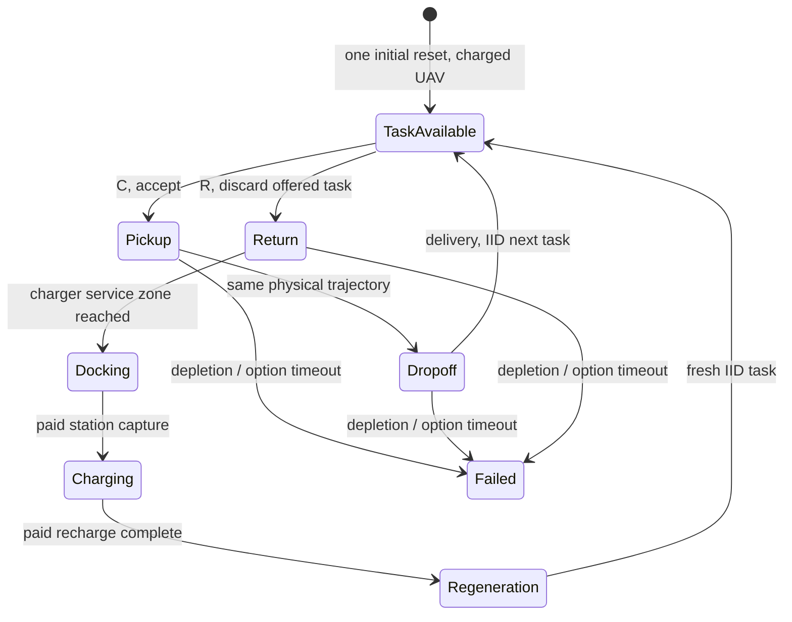

# P1 — continuing regenerative single-UAV control

## Material Passport / scope

2026-09-19, based on repository `43f48be5`. Working title:
**Safe Regenerative Average-Reward Control for Persistent Agents**.
This deliverable is P1 infrastructure and bounded empirical smoke evidence only.
No P2 solver, reserve-vs-oracle kill test, learned energy predictor, high-level
training, or claim of a new scientific mechanism is included.

The user amended P0: **P0-A PASS for research startup in the restricted region;
P0-B legacy energy-critic qualification CANCELLED / no longer required.** It is
not an energy-critic failure. The old P0 audit and its raw measurements are
preserved; its obsolete stopping rule is explicitly superseded.

## Implemented environment

| Item | P1 definition |
|---|---|
| Agents | One UAV; no auction, communication, congestion or agent-agent collisions |
| Navigator | Deterministic frozen SAC actor, SHA256 `fb79482ae7d832b40137ff1a080ee84912eabb95867e118aca80c846f6ae62be` |
| Task process | Always-available IID stationary stream; task value 1; uniform over distances 100/300/600 |
| Geometry | Home H=[2880,2000,200]; pickup H+[-d,0,0]; dropoff H+[-d,d,0] |
| Decision epoch | Before accepting a new task, following delivery or recharge completion |
| C | Accept and execute pickup→dropoff; no intermediate C/R decision |
| R | Reject the offered task, navigate to charger, dock, recharge, draw a fresh task |
| Battery | Capacity 60 in existing synthetic telemetry-energy units, not Wh |
| Delivery | Retain actual position, velocity, battery, time and contact memory; next task arrives immediately |
| Recharge | Paid station capture and charging; no `env.reset()` |
| Evaluation | Configurable cutoff, default 50,000 simulator seconds; this bounded trace uses 1,000 |
| Failure | Energy depletion or 4,000-step navigation-option timeout; no rescue, restart or new task after failure |
| Scientific reward | One per delivered task; separate collision/failure/time/energy records; no reward shaping |



Pickup/dropoff service is instantaneous in this first abstract task family. The
queue is saturated, so task waiting time is zero by definition; this is not yet
an arrival-rate experiment. Rejecting an offered task at R is recorded as
`abandoned`, but it is **not mid-task abandonment**. Existing scalar navigation
reward is not the high-level objective and no optimizer uses it.

The legacy plant's navigation-goal terminal flag is interpreted as a **leg-end
signal**. The new wrapper changes goals and per-option counters without calling
reset or replacing the UAV. Global time/steps, actual pose, velocity and battery
persist. Battery depletion uses the inherited physics-substep rule. The episode
step guard is disabled, while the declared 4,000-step option timeout remains an
explicit failure outcome rather than a hidden fresh episode. A cutoff can censor
an unfinished leg or partial charge; it never grants full energy or a delivered
task. Navigation is censored on its 0.05-second physics grid (at most <0.05 seconds
short of a general cutoff); service is time-censored continuously.

## Station service and regeneration audit

Station service is explicit, not a free snap to home:

1. Frozen SAC reaches the inherited 5-unit charger service radius.
2. A declared ground-service capture actuator moves from the arrival point to
   exact H at speed 1 unit/second, consuming 0.02 energy/second. Its linear path
   is checked in simulator physics for obstacle clearance. Position and clock
   advance together; this is a station-service abstraction, not additional SAC
   navigation or a claim of measured docking hardware.
3. Zero velocity at the dock, 10-second overhead, then charge at 1 energy/second.
   The station supplies energy during this connected phase.
4. One actual clean zero-action plant step at H clears contact memory under the
   frozen collision rule, with its time and subsequent energy refill charged.
   Service never simply clears a collision flag to change the next penalty.
5. Emit `recharge_complete` with no carried task, then draw the next IID task.

At each recorded recharge completion:

```
position        = [2880, 2000, 200]
velocity        = [0, 0, 0]
battery         = 60
carried task    = None
previous contact= False
map             = fixed throughout this run
future process  = fresh uniform task draw from the same stationary IID process
```

**Renewal scope:** conditional on the fixed layout and a stationary controller
whose relevant internal memory also renews. Global timestamp, cumulative totals,
and PRNG machine state are bookkeeping, not components claimed to have the same
literal value after each cycle. A policy depending on absolute time or persistent
memory would need a separate renewal argument. We do not pool different fixed
maps as one unconditional renewal state.

Task RNG and layout/initial-velocity RNG streams are separate. The task generator
advances continuously; it is never reset to its original seed at recharge.
Independence is a property of the declared IID generative model (implemented with
a reproducible PRNG), not a statistical conclusion from six observed recharges.
The initial charged departure is marked `initial_delayed_cycle`; exclude it and
the final censored excursion from complete renewal-cycle inference.

## Macro collection and observability

Implementation: `research/regenerative_control/continuing.py` and `collect_p1.py`.
Each macro row stores state ID/group, option, start/end energy, energy used,
elapsed simulator time, success, contact boolean, unified collision count,
timeout, terminal reason, censoring, reward and exact next macro state. Its
`legs` preserve the corresponding go-pickup, go-dropoff and return-charger
transitions. Raw full states include exact pose/velocity, task progress, map ID,
layout and RNG state for **privileged auditing / future oracle construction**.

The actor receives only its frozen 2056-dimensional goal/velocity/LiDAR/option-
time observation. No obstacle centers/radii, full map, RNG or simulator clearance
is passed to the actor. Station path legality uses geometry for physics only.
There is no deployable energy predictor to receive privileged information.

The empirical pilot has two fixed layouts (4 versus 24 obstacles) and two
options, 32 replicates each. Seeds and sampling distribution are source-bound:
initial vx,vy ~ U[-1,1], vz ~ U[-.2,.2], then deterministic frozen SAC. For `task`,
start at H and execute the whole pickup/dropoff job; for `return`, start at the
corresponding dropoff and execute return **plus paid station service**. Each
independent conditional trial has one initialization; that is not a reset inside
the continuing trajectory. Each row retains the actual initial velocity.

These are distributions over **declared initial-state groups**, not repeated
stochastic outcomes from identical full simulator states. A fixed full state,
fixed layout and deterministic actor give deterministic navigation here. No wind,
sensor noise or hidden random action was invented to manufacture uncertainty.
The denser layout is called `far_dense`, not proof that every route is hard.

Empirical q95 uses order-statistic `method='higher'`. With only 32 draws it is a
smoke statistic, not a 95%-coverage certificate. Failure expenditure is retained
as failure data; it is never treated as completed-mission energy. The collector
reports success-conditional quantiles separately and withholds its finite
unconditional completion-energy field if any failure/censoring occurs.

**No joint mission quantile has been estimated in this P1 table.** `task` q95 plus
`return` q95 is not a mission q95. P2 must directly collect full task→return
sequences from the same trajectory, with their actual dependent end states.

## P2 readiness boundary

The wrapper and raw transition schema are ready for subsequent model design;
**the finite Markov kernel is not complete**. Do not call these four group rows an
oracle model. In particular:

- Dropoff position error and residual velocity persist. A location label plus
  battery alone has not been shown sufficient; exact state and contact memory
  are saved so a future discretization can retain/test them.
- The pilot starts at capacity 60. It does not cover low-energy failure states,
  every dropoff→new-pickup combination, or alternative task regimes.
- Every group fixes a layout. Pooling them while omitting layout/context would
  silently mix kernels with different persistent hidden state.
- At physical depletion the inherited plant clips battery at zero after a full
  substep. Low-energy kernel work must explicitly distinguish full-substep energy
  demand from available battery; the current strict balance audit stops such an
  inconsistent row rather than silently certifying it. The 60-unit smoke has no
  such depletion and all balance checks pass.

The next authorization is for P2 design/collection and its discretization, not
for neural learning. Baselines then use the same empirical model: battery,
distance, expected mission energy, empirical joint-mission q95 and MPC H=1/2/3.
Old ReturnManager is optional, not mandatory. The ≥.98 simple/oracle kill rule
remains unchanged; no ratio or sign-flip result exists yet.

## Validation and versioning

Nine focused tests pass: physical-state continuity on goal switching, no reset or
refill at delivery, paid canonical recharge/RNG advancement, partial-charge cutoff,
short remaining-window completion, depletion stop, atomic snapshot replay,
failed-expenditure quantile handling, and frozen contact penalties. One .2-second
execution smoke passed. The first four collector rows were atomically saved,
checked, and resumed; completion remained bounded to the requested 32×4 smoke.
No 50,000-second study or later training was launched.

Initial v1 smoke output is preserved in `artifacts/regenerative_p1_20260919`.
An end-of-service cutoff guard was unnecessarily conservative. V2 charges only
the actual clean-step/refill duration, and incomplete task legs cannot be labeled
as completed tasks. A boundary regression test was added, then the same bounded
pilot and trace were run in `artifacts/regenerative_p1_20260919_v2`. Final results
below refer exclusively to v2. No historical frozen runtime source was edited.

The collector supports atomic per-row resume, hash-validates committed rows and
source contracts, and saves the continuing environment/RNG at each macro boundary.
A killed incomplete conditional trial can be replayed from its predefined seed;
committed rows are skipped. The saved local trace checkpoint is a trusted local
pickle, not an interchange format for untrusted data. Portable JSON/gzip evidence
is provided separately in the repository for review without an `artifacts/` tree.

## Actual v2 smoke results

| State group | Option | n | Success | Contact trials | Mean energy | Empirical q95 energy | Mean total time (s) |
|---|---|---:|---:|---:|---:|---:|---:|
| near_light | task | 32 | 32/32 | 0 | 3.97808 | 4.02028 | 17.39062 |
| near_light | return | 32 | 32/32 | 0 | 2.48477 | 2.53395 | 27.49165 |
| far_dense | task | 32 | 32/32 | 0 | 21.46495 | 21.89970 | 103.30625 |
| far_dense | return | 32 | 32/32 | 0 | 9.94825 | 10.02756 | 69.56529 |

Return includes station capture, charging and the final clean-step/refill. Its
mean flight-only time is 10.27813 seconds (near) and 44.82813 seconds (far).
Energy reports consumption, not net battery change: an R macro ends full after
replenishment. No neural predictor was fit to these measurements. The v1 and v2
smoke tables are numerically identical; the corrected cutoff case is covered by
the new regression test rather than hidden by replacing the initial output.

## Actual long continuing trace

Fixed diagnostic schedule: accept two tasks per cycle, then R; also R below 30
energy. This is a semantics demonstration, not a tuned baseline or performance
comparison. In 1,000 simulator seconds: **14 deliveries, 6 recharge completions,
0 collisions, 0 depletion, exactly 1 initial plant reset**. Throughput 0.014 tasks/s
is a single-trace diagnostic number, not a policy-value estimate with confidence
intervals. There are five complete recharge-to-recharge intervals, an initial
charged excursion and a right-censored final excursion.

Selected events (full 112-event trace is in the evidence bundle):

```text
    0.000  initial_charged_state    energy=60.00000  reset_calls=1
   18.050  pickup_reached           energy=56.33989  reset_calls=1
   40.300  delivery_complete        energy=51.12602  reset_calls=1
   61.500  pickup_reached           energy=46.19573  reset_calls=1
   75.100  delivery_complete        energy=43.08605  reset_calls=1
   75.100  decision_R               energy=43.08605  reset_calls=1
   86.800  return_reached           energy=40.17499  reset_calls=1
   91.718  recharge_start           energy=40.07663  reset_calls=1
  121.694  recharge_complete        energy=60.00000  reset_calls=1
  139.744  pickup_reached           energy=56.33989  reset_calls=1
  161.994  delivery_complete        energy=51.12602  reset_calls=1
  183.194  pickup_reached           energy=46.19573  reset_calls=1
  196.794  delivery_complete        energy=43.08605  reset_calls=1
  196.794  decision_R               energy=43.08605  reset_calls=1
  208.494  return_reached           energy=40.17499  reset_calls=1
  213.412  recharge_start           energy=40.07663  reset_calls=1
...
1000.000  evaluation cutoff during final recharge; no free full-battery event
```

All macro boundaries and pickup→dropoff boundaries preserve position, velocity,
time and battery exactly. The raw-ledger energy balance residual is -1.081e-12.
The final cut-off charge is not counted as a completed regenerative event.

## Reviewable evidence and commands

Portable evidence: [`research/regenerative_control/evidence/p1_20260919`](../research/regenerative_control/evidence/p1_20260919).
It contains the frozen source/checkpoint manifest, 128 raw macro records as
JSONL/gzip, full trajectory JSON/gzip, a plain event CSV, summary tables, receipt,
and a SHA256 index. No remote `artifacts/` tree is needed to inspect the results.
The full local resumable environment checkpoint remains in
`artifacts/regenerative_p1_20260919_v2/trace_checkpoint.pkl`.

```bash
PYTHONPATH=. .venv/bin/python -m pytest -q tests/test_regenerative_p1.py
PYTHONPATH=. .venv/bin/python scripts/audit_regenerative_p1.py
PYTHONPATH=. .venv/bin/python research/regenerative_control/collect_p1.py --output artifacts/regenerative_p1_20260919_v2 --n 32 --trace-cutoff 1000 --resume
```

The resume command verifies the same source contract, skips completed conditional
trials and loads the completed demonstration checkpoint. It does not extend the
window, fit a model or launch P2. Final state: **P1 bounded deliverables complete;
no background job remains from this task; P2 awaits the next review/authorization.**
