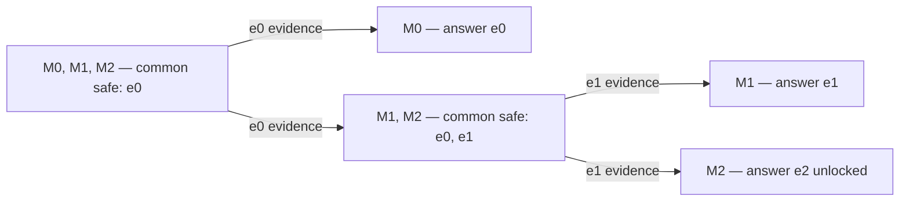

# Safe refinement: reducibility audit

Date: 2026-09-21. Audited artifact: `d35cdc7`; experimental source: `c85b38a`.
This is a mathematical and primary-source audit, not a new experiment or a
revision of frozen protocol v1. The original proofs and all results remain intact.

## Verdict

**Novelty clearance: unresolved. No authorization to expand experiments.**

The three requested papers do not immediately supply the stated finite-menu iff
by a theorem application established here. This is not evidence that no such
reduction exists. In particular, the general monotonic Safe BAI reduction remains
open. The project has neither passed its novelty test nor met the stronger kill
condition of a demonstrated direct corollary.

We establish a three-model, three-action separation from a *constant robust-safe
query menu*, and a narrower obstruction to an information-preserving embedding
in linear Safe BAI. Neither separates the problem from general safe exploration.
We also give an exact controlled-sensing representation: describing the problem
as a new kind of RL or claiming that controlled sensing cannot encode it is not
justified. A representation alone supplies no new sharp complexity theorem.

The defensible current description is **finite safe sequential experimental
design with model-dependent action safety and multiple acceptable answers**.
The 47,000 jobs validate the implementation and constructions, not novelty.
The UAV common-optimal-arm null result remains a null result.

## What a reduction must preserve

There are three different questions:

1. Statistical encoding: represent each model by its observation laws and answer
   set. This can discard the dangerous-query restriction.
2. Operational equivalence: one model-independent encoding preserves causal
   policies, complete observations (including rewards and durations), available
   action prefixes, catastrophe absorption, answer validity and interaction cost.
3. Theorem transfer: check every assumption of an existing result, and explicitly
   convert its risk, correctness, termination and time guarantees into ours.

Only the third establishes that Theorem 2 is a direct corollary. A safety wrapper
is not a free reduction if it invalidates the sampler or the assumptions used in
the target upper bound. Conversely, inability to embed in a narrow linear model
does not establish separation from the whole safe-learning literature.

## Primary-source comparison

### Wang, Wagenmaker and Jamieson (AISTATS 2022)

Source: [Best Arm Identification with Safety Constraints](https://proceedings.mlr.press/v151/wang22h/wang22h.pdf),
Section 3, Definitions 1–3, and Sections 4–5.

Their learner selects a coordinate and dose, observes noisy reward and safety,
and starts with a positive known-safe dose for every coordinate. The linear
model has means `a theta_i` and `a mu_i`; the monotonic extension is more general.
The safe dose range is learned and expanded. Definition 1 already controls safety
across the query sequence, rather than assigning fresh risk to each query.
The monotonic formulation permits a safety tolerance beyond the optimization
threshold; that tolerance cannot silently be equated with our hard catastrophe
threshold. They seek a best coordinate rather than arbitrary overlapping answers.
Their linear bounds and monotonic algorithm therefore require separate transfer
arguments. **It is incorrect to classify this work as fixed-safe-menu BAI.**

Our derived linear obstruction is below. It does not settle the monotonic case.
A complete reduction would have to specify all dose-response functions, ensure
baseline queries disclose no extra distinguishing information, preserve query
costs and hard safety, and map acceptable answers. None is supplied here.

### Degenne and Koolen (NeurIPS 2019)

Source: [Pure Exploration with Multiple Correct Answers](https://proceedings.neurips.cc/paper_files/paper/2019/file/60cb558c40e4f18479664069d9642d5a-Paper.pdf),
Section 2 and Theorem 1.

Their framework allows structured model classes and set-valued correct answers.
Its lower bound optimizes over valid answers and allocations against alternatives
where the answer is invalid. Thus decision identification instead of full model
identification is not a new principle. Arms are queryable without a
model-dependent catastrophic transition.

For our Bernoulli subfamily, mapping experiments to arms preserves the statistical
laws. Mapping every arm gives an unsafe-access relaxation; retaining only initially
common-safe arms removes later unlocking. A stateful safety wrapper restores the
missing restriction, but their unrestricted allocation guarantee does not
immediately apply to that wrapper. Encoding entire adaptive learning policies as
arms instead changes finite-arm, duration and repeated-sampling assumptions.
**No direct upper-bound or iff transfer has been established.** This is not a
proof against every possible enriched encoding.

### Yang, Zheng and Li (2026)

Source: [On the Equilibrium between Feasible Zone and Uncertain Model in Safe Exploration](https://arxiv.org/html/2602.00636v1),
Sections II–IV, particularly Theorems IV.1–IV.5. This audit uses the explicitly
versioned author preprint, not an assumed identical journal pagination.

This work already makes mutual model refinement and feasible-zone expansion
central. Its formulation uses deterministic dynamics, calibrated set-valued
uncertainty and structural continuity/Lipschitz assumptions. Theorems IV.1–IV.3
address refinement, expansion and equilibrium; IV.5 is a robust feasibility
Bellman equation. These are not stated as finite noisy-model identification-time
bounds with arbitrary acceptable answers.

A transfer must map our noisy observation process and statistical exclusion risk
into those assumptions and recover our termination/answer guarantee. Adding an
unobserved random tape does not by itself verify them. **The qualitative
co-expansion story is prior art; the specific iff transfer is unproved here.**

### Existing active testing already has dynamic programming

Source: [Naghshvar and Javidi, Active sequential hypothesis testing](https://arxiv.org/pdf/1203.4626),
Sections 2–3, Fact 1 / equation (4).

They formulate adaptive testing as a partially observed problem with a static
hidden hypothesis, known observation laws, and posterior belief as information
state. Their Bellman equation trades sampling cost against declaration error.
Consequently, introducing a Bellman equation is not itself a contribution.
Our absorbing safety constraints and uniform model-wise risk require additional
structure before that particular result can be used.

## Proposition A: a three-model, three-action witness

This is a new derivation in this audit, not a reported simulation or a literature
novelty claim. Every safe action lasts one time unit, returns to the same base,
and emits its deterministic reward plus the indicated independent Bernoulli
sensor. Every unsafe action immediately enters an absorbing catastrophic state.
The three actions are also the three deployment options: repeat the chosen action.
There are no uncounted exploit actions.

| Model | e0 | e1 | e2 | Unique optimal safe answer |
|---|---|---|---|---|
| M0 | safe; reward .2; Ber(.25) | catastrophe | catastrophe | e0 |
| M1 | safe; reward .2; Ber(.75) | safe; reward .6; Ber(.25) | catastrophe | e1 |
| M2 | safe; reward .2; Ber(.75) | safe; reward .6; Ber(.75) | safe; reward 1; constant sensor | e2 |

Initially the common-safe menu is `{e0}`. Its observational partition is
`{M0}` and `{M1,M2}`. In the latter block the menu becomes `{e0,e1}`; e1
separates M1 from M2, after which e2 can become certified safe.

Proof of fixed-menu separation: e0 has identical full observation laws under M1
and M2, while their answers differ. No algorithm querying only e0 can distinguish
them, however it stops or randomizes. A constant menu excluding e1 cannot express
the later e1 query; a constant menu including e1 admits a root query catastrophic
in M0. Therefore no identity-of-actions, action-prefix-preserving **constant
robust-safe menu** represents both stages. A confidence-dependent guard can
represent them, precisely by adding the restriction absent from a constant menu.

Finite-confidence learnability: use anytime likelihood tests with stage error
budgets summing to delta. On simultaneous coverage, each unlocked action is safe;
positive Bernoulli KL permits finite stage termination. Noisy finite histories
have common support, so this does not assert zero-risk finite-time unlocking.
The tree is the ideal observational partition; finite-time branch decisions can
be wrong with the allocated probability.

Three models are minimal for this particular two-stage structure: a proper
first refinement must leave at least two unresolved models to separate later.
Three actions suffice, including a distinct optimal safe deployment for each
model. We claim no global minimality over arbitrary reward/answer conventions.

## Proposition B: obstruction in the linear Safe BAI submodel

Take a finite collection of parameter candidates satisfying Wang et al.'s linear
assumptions and fixed positive safe baselines `a0_i`. Suppose two candidates have
identical complete observation laws at every baseline query. Their expectations
are equal, so

`a0_i theta_i = a0_i theta'_i` and `a0_i mu_i = a0_i mu'_i` for every i.

Since `a0_i > 0`, all reward and safety parameters agree. Consequently the best
coordinate agrees. Thus decision-incompatible candidates cannot remain
observationally identical on all these initial safe baseline queries.

The M1/M2 pair in Proposition A does remain identical on the entire initial
common-safe menu and has incompatible answers. Any embedding satisfying the
above linear assumptions must therefore either supply extra distinguishing
baseline information or fail to preserve the answer problem. This rules out
that narrow information-preserving embedding. It does not rule out nonlinear
monotonic dose-response constructions or more general safe exploration.

## Proposition C: exact encoding in constrained controlled sensing

Let the hidden model M be static. Observable physical state is `live` or `dead`.
At live, querying e emits the complete law `P_M^e` and returns live if e is safe
under M; otherwise it enters dead with the original failure observation and
cost. Dead is absorbing. A stop action declares answer a, with correctness
indicator `a in A(M)` and the original deployment-safety requirement.

The same history-dependent randomized policy can be used in either problem.
Induction on interaction prefixes gives equality of transcript laws, costs,
catastrophe events and answer events for each M. Hence this is an exact
representation as risk-constrained controlled sensing. For variable-duration
experiments the clock/cost belongs in the observation or semi-Markov transition.
For confidence-guarded learners, include the algorithm's confidence state and
restrict queries to its common-safe menu.

This proves expressibility, not the desired kill condition: the constrained
representation is more general than ordinary unrestricted active testing, and
no cited matching theorem is transferred by this construction. It also shows
why a claim that the problem is fundamentally outside controlled sensing would
be false. General regenerative MDP reduction has not been proved.

## Repairing the proposed complexity object

### V alone is not a sufficient continuation state

In binary testing, let `L` be cumulative log likelihood and `h` a fixed valid
unlock threshold. Histories with `L=0` and `L=h-a` can retain exactly the same
`V={M0,M1}`, yet a single increment a can certify at the second history and not
the first. Their remaining stopping-time distributions differ. Even this fixed
policy cannot be evaluated from V alone. An optimal evidence-reusing formulation
needs likelihood information and the confidence/risk bookkeeping. Restarting a
fresh test at each V defines a restricted strategy, not the unrestricted optimum.

Uniform frequentist constraints are also not interchangeable with an average
Bayesian risk. A Bellman `sup_M` independently at each history can inadvertently
let the adversary change the true model. M is selected once for the whole life.

### Certification time must be defined on failure paths

If `tau_cert=infinity` on catastrophe, any positive catastrophe probability makes
`E[tau_cert]` infinite. A finite expected-time theorem must instead specify time
to resolution (stop or catastrophe), a penalized objective, a conditional metric,
or a high-probability certification bound. Conditional time alone can hide early
failures. Do not silently replace one objective with another.

### Multiple answers require answer-specific alternatives

For three models with answer sets `{a,b}`, `{b,c}`, `{a,c}`, every pair has an
acceptable answer in common, but the intersection of all three sets is empty.
A complexity using only pairs with disjoint answer sets sees no pairs and misses
the need to gather information. For a chosen answer a, the relevant alternatives
are all models for which a is invalid. Combining this geometry with adaptive safe
menus is the unresolved quantitative target; answer geometry alone is prior art.

### A well-defined finite-horizon starting point, not a matching bound

For finite observations and a finite remaining query count, retain attainable
vectors `(c_m,q_m)_m` of expected resolution costs and probabilities of failure
(catastrophe, invalid answer, or unresolved at the deadline). At zero remaining
queries, stop with an answer, or mark unresolved as failure. A stop with answer a
has `c_m=0`, `q_m=1[a not in A(m)]`, assuming valid answers include safe deployment.
For a safe query e and child vectors selected as a function of observed z:

`c_m = d_m(e) + sum_z P_m^e(z) c_m^z`,

`q_m = sum_z P_m^e(z) q_m^z`.

For an unsafe query, use the actual catastrophe cost and `q_m=1`. Child policies
must be shared across models for each z; selecting a different child for each
unknown true model would create an oracle. Learner randomization takes common
convex combinations of vectors. History/confidence state restricts the menu when
studying robust-safe confidence algorithms. Root optimization minimizes
`max_m c_m` subject to every `q_m <= delta`.

This recursion follows by conditioning and is only a precise finite-horizon
representation. It is not an efficient algorithm, an information lower bound,
or a proof that its infinite-horizon limit attains the desired complexity. No
interchange of infimum, supremum or infinite-horizon limit is asserted.

## Decision record and remaining proof obligations

| Question | Finding |
|---|---|
| Is safe-set/model co-expansion new? | No defensible claim; clearly present in prior work. |
| Is decision identification rather than full identification new? | No. |
| Does a fixed initially safe menu lose capability? | Yes; Proposition A proves a restricted separation. |
| Does linear Safe BAI directly contain that witness without extra information? | No under Proposition B's explicit preservation requirements. |
| Does general monotonic Safe BAI contain the whole problem? | Unresolved; no complete reduction or impossibility proof. |
| Is the problem representable as controlled sensing? | Yes, with absorbing risk constraints; Proposition C. |
| Is Theorem 2 a direct corollary of one of the three papers? | Not established in this audit. |
| Is Theorem 2 certified novel? | No. |
| Is a general matching adaptive-menu complexity theorem proved? | No. |

The concrete remaining novelty test is to complete the monotonic Safe BAI
encoding or prove an obstruction that survives its full assumptions, and inspect
whether an existing constrained-testing theorem yields the terminal-block iff.
A positive claim needs an explicit theorem-to-theorem derivation or a genuine
new theorem, not another synthetic comparison. Broad non-reducibility cannot
be inferred from this witness. Do not describe this audit as a novelty PASS.

Permitted claims now: finite-menu characterization under the documented
assumptions; staged testing bounds; synthetic checks; honest UAV null result.
Withhold claims of first safe reset-free RL, first safe-set expansion, first
decision-relevant identification, or general matching complexity.

No simulation, training, protocol change, seed change or performance-dependent
selection was performed for this audit.
